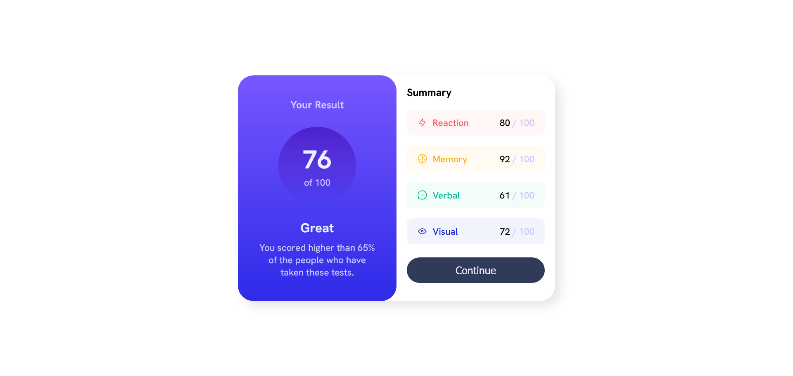
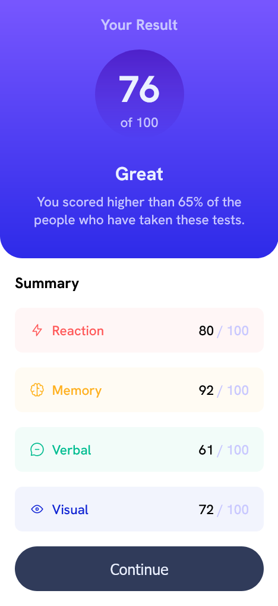

# Frontend Mentor - Results summary component solution

This is a solution to the [Results summary component challenge on Frontend Mentor](https://www.frontendmentor.io/challenges/results-summary-component-CE_K6s0maV). Frontend Mentor challenges help you improve your coding skills by building realistic projects.

## Table of contents

- [Overview](#overview)
  - [Screenshot](#screenshot)
  - [Links](#links)
- [My process](#my-process)
  - [Built with](#built-with)
  - [What I learned](#what-i-learned)
- [Author](#author)

## Overview

### Screenshot

### Links

- Solution URL: [GitHub](https://github.com/Debesta/Frontend-Mentor---results-summary-component)
- Live Site URL: [Netlify](https://zingy-platypus-f125f9.netlify.app/)

## My process

### Built with

- Semantic HTML5 markup
- SCSS custom properties
- Flexbox
- Mobile-first workflow

### What I learned

Well, I didn't learned something new, but I could work again with margins and paddings.

## Author

- GitHub - [@Debesta](https://github.com/Debesta)
- Frontend Mentor - [@Debesta](https://www.frontendmentor.io/profile/Debesta)